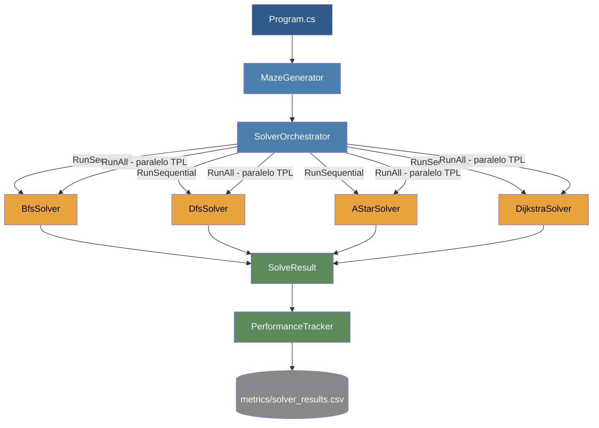

# Arquitectura del Sistema
## Diagrama de componentes

## Flujo de ejecución

1. `Program.cs` genera el laberinto una sola vez con `MazeGenerator.Generate(size, size, seed: 42)`.
2. Se instancian los 4 solvers (`BfsSolver`, `DfsSolver`, `AStarSolver`, `DijkstraSolver`), todos implementando la interfaz común `ISolver`.
3. `SolverOrchestrator.RunSequential(...)` corre los 4 uno por uno — sirve de referencia base de tiempo.
4. `SolverOrchestrator.RunAll(...)` corre los 4 en paralelo con Task Parallel Library, guardando cada resultado en un `ConcurrentDictionary<string, SolveResult>` thread-safe (ver `docs/EstrategiaParalelizacion.md` para el detalle).
5. Se calcula speedup (tiempo secuencial ÷ tiempo paralelo) y eficiencia (speedup ÷ cantidad de algoritmos).
6. `PerformanceTracker` exporta los resultados de la corrida paralela a `metrics/solver_results.csv`.

## Namespaces del proyecto

| Namespace | Contenido |
|---|---|
| `MazeSolver` | `Program.cs` — punto de entrada |
| `MazeSolver.Maze` | `MazeCell`, `MazeGenerator` — generación del laberinto |
| `MazeSolver.Solvers` | `ISolver` y las 4 implementaciones (BFS, DFS, A*, Dijkstra) |
| `MazeSolver.Orchestration` | `SolverOrchestrator` — ejecución secuencial y paralela |
| `MazeSolver.Metrics` | `SolveResult`, `PerformanceTracker` — resultados y export a CSV |

## Contratos clave

- **`ISolver`** (`docs/ContratoSolvers.md`): todos los algoritmos reciben `(maze, start, goal)` y devuelven `SolveResult`, sin modificar el laberinto.
- **Thread-safety**: cada solver mantiene su propio estado interno (cola/pila/diccionario de visitados); el único punto compartido es el `ConcurrentDictionary` de resultados en `SolverOrchestrator.RunAll`.